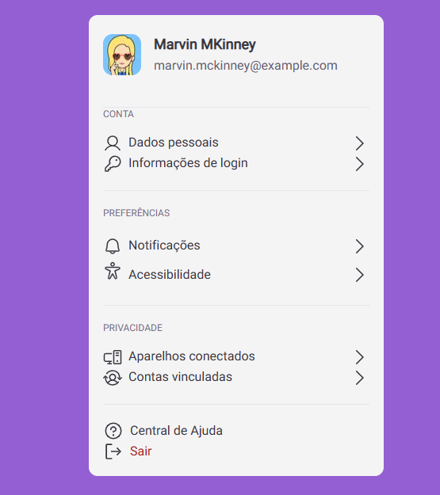

# Project Profile-Settings
## Desafio 22
``=>`` [Desafio no figma](https://www.figma.com/file/TJ4uFT9WKp1hEkJBLjMcfw/Profile-Settings--%E2%80%A2-Desafio-22-(Community)?type=design&node-id=0-1&mode=design)

## Tecnologias Utilizadas
    - Reactjs
    - Tailwindcss

